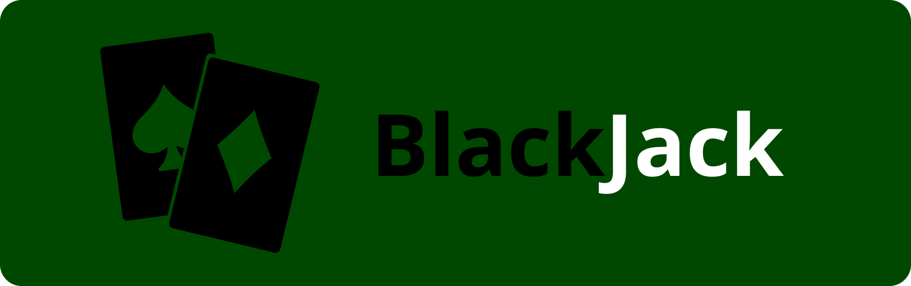

  

###

  
  
  
  

## 🃏 BlackJack

### Sobre o Jogo

**BlackJack** é um jogo de cartas inspirado no popular jogo "21", muito conhecido no Brasil. Desenvolvido com **JavaScript**, o jogo é interativo e pode ser jogado diretamente no navegador ou compilado como uma aplicação independente.

### Funcionalidades

- 🎮 Jogo de cartas interativo baseado nas regras tradicionais do BlackJack.
- 💻 Interface simples, amigável e responsiva, proporcionando uma experiência suave em qualquer dispositivo.
- 📱 Compatível com navegadores ou como aplicação independente para desktop ou mobile.

### 🛠️ Tecnologias Utilizadas

  

### 📜 Licença

Este projeto está licenciado sob a [Licença MIT](LICENSE).

---

© 2025 Maicon Gonçalves Wandermazz
